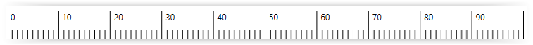
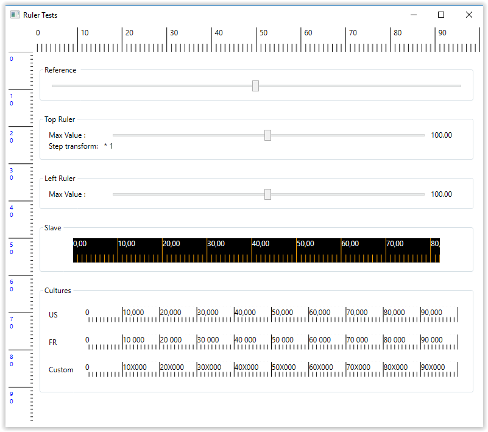

# Ruler.Wpf
[](https://opensource.org/licenses/MIT)


In the WPF world, many controls exist, but it difficult to find a ruler. This project proposes a simple ruler usable in all Net Core 3.1 and Net Framework 4.7.2.



## Focused objectives
- Performance
- Simplicity
- Customization
- Maintainability

## Features
Features available in control are:
- Definition of custom main step for scale
- Dynamic scale on resize
- Horizontal and vertical support (top and left position)
- Mark linked to mouse position
- ~~Multi ruler synchronization~~ (i broke this with the new rendering system)
- Multi cultures
- Multiscale units
- Styling sample
- MVVM pattern

## Getting started

Add the resource dictionary inside application resources:

```xml
<ResourceDictionary>
  <ResourceDictionary.MergedDictionaries>
    <ResourceDictionary Source="pack://application:,,,/Ruler.Wpf;component/RulerStyle.xaml"/>
  </ResourceDictionary.MergedDictionaries>
</ResourceDictionary>
``` 

Use control as you need

```xml
<ruler:Ruler MarkerControlReference="{Binding ElementName=mainView}"
             MaxValue="400"
             MajorStepValues="{Binding MajorStep}"
             ValueStepTransform="{Binding ValueStepTransform}">
    <ruler:Ruler.Resources>
        <Style TargetType="TextBlock" BasedOn="{StaticResource {x:Type TextBlock}}">
            <Setter Property="Margin" Value="5 0"/>
        </Style>
    </ruler:Ruler.Resources>
</ruler:Ruler
``` 

## ScrollViewer
This control now supports being added to scroll viewers. The rendering accesses the scroll viewer's viewport and extent sizes and horizontal offset (haven't implemented vertical yet but it can't be too hard to modify yourself) to calculate the "drawing/visible" area on screen (by default this stretches the control's entire width when not in a scroll viewer)


### Testabilty
A WPF Net Core application shows how to use the ruler.


